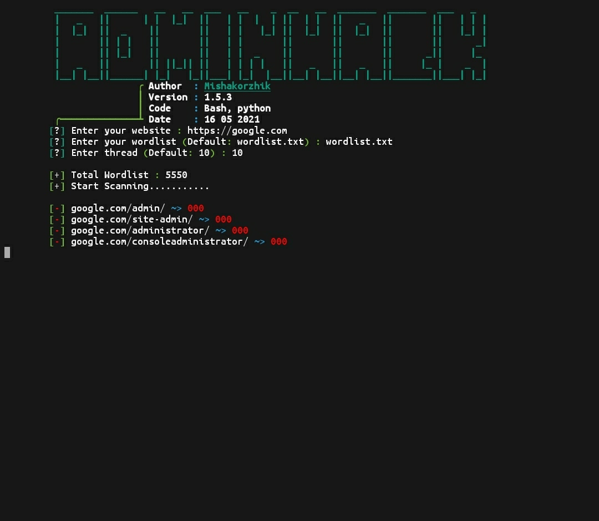
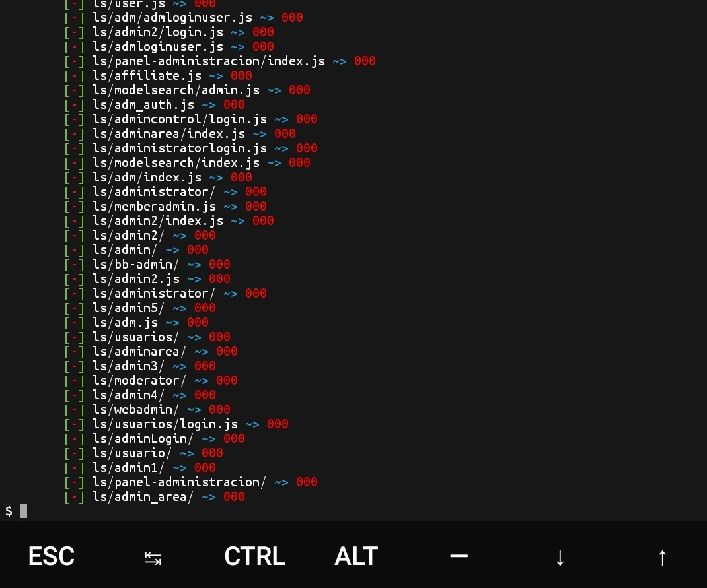

• <a href="https://github.com/mishakorzik/AdminHack/blob/main/LICENSE">License</a> 
• <a href="https://github.com/mishakorzik/AdminHack/issues">Issues</a> 
• <a href="https://github.com/mishakorzik">Developer</a> 
• <a href="https://github.com/mishakorzik/AdminHack/wiki">Wikipedia</a> •

**A script to find admin login pages and EAR vulnerabilites.**

> Я не несу ответственности за ваши действия. Скачивая программное обеспечение из этого репозитория, вы соглашаетесь с [лицензией](https://github.com/mishakorzik/AdminHack/blob/main/LICENSE).

#### Features
- [x] Multi-threading on demand
- [x] Big wordlist list (5550 patch)
- [x] Supports php, asp and html extensions
- [x] Checks for potential EAR vulnerabilite
- [x] Support for custom patns
- [ ] Checks for robots.txt

---
## Installing for termux

* `pkg upgrade`
* `pkg update`
* `pkg install git`
* `pkg install php`
* `git clone https://github.com/mishakorzik/AdminHack`
* `cd AdminHack`

#### Everything is ready! Now we are waiting for everything to download!
 * `succes`

---
## Installing for linux

* `apt update`
* `apt upgrade`
* `apt install git`
* `apt install php`
* `git clone https://github.com/mishakorzik/AdminHack`
* `cd AdminHack`

---
## Start Program Termux and Linux
#### Enter a command to start AdminHack.

* `bash AdminHack.sh`

#### If there are problems then look down there will be if failed to download.
---
## if failed to download

* `cd AdminHack`
* `cd src`
* `bash ReloadInstall.sh`

#### Succesfull error fixed.

* `succes`
---
## Screenshot

#### here you can see a screenshot of AdminHack
 

 

## Find Me 

###### By mishakorzhik: Report bug: misakorzik528@gmail.com

## Supporters

